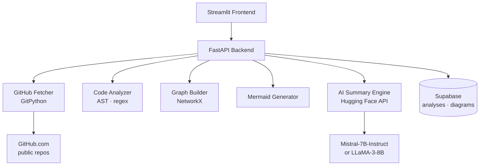

# 🏗️ Repo2Arch

> **GitHub → Architecture Diagram Generator**
> Paste any public GitHub URL and instantly generate architecture diagrams,
> interactive dependency graphs, AI summaries and tech stack insights.

[](https://python.org)
[](https://fastapi.tiangolo.com)
[](https://streamlit.io)
[](https://supabase.com)
[](https://huggingface.co/inference-api)

---

## ✨ Features

| Feature | Description |
|---|---|
| 🏗️ **Architecture Diagram** | Auto-generated Mermaid `graph TD` from real code structure |
| 🔗 **Dependency Graph** | File-level import graph via NetworkX + PyVis (draggable, physics-based) |
| 🧠 **AI Summary** | Architecture explanation + improvement suggestions via Hugging Face LLM |
| ⚙️ **Tech Stack Detection** | Languages, frameworks, dependencies detected with AST + regex |
| 📊 **Repo Insights** | File counts, entry points, CI/Docker detection |
| 🕰️ **Analysis History** | Past analyses stored and cached in Supabase |

---

## 🏛️ System Architecture



---

## 🗂️ Project Structure

```
repo2arch/
├── backend/
│   ├── app/
│   │   ├── main.py               # FastAPI app factory + middleware
│   │   ├── config.py             # Settings via pydantic-settings
│   │   ├── api/
│   │   │   └── routes.py         # All API endpoints
│   │   ├── models/
│   │   │   └── schemas.py        # Pydantic request/response models
│   │   ├── services/
│   │   │   ├── github_fetcher.py # Clone + traverse repos
│   │   │   ├── code_analyzer.py  # AST + regex analysis
│   │   │   ├── graph_builder.py  # NetworkX graph engine
│   │   │   ├── mermaid_generator.py  # Graph → Mermaid DSL
│   │   │   ├── ai_summary.py     # Hugging Face Inference API
│   │   │   └── supabase_client.py    # DB operations
│   │   └── utils/
│   │       └── helpers.py        # Shared utilities
│   ├── requirements.txt
│   └── .env.example
│
├── frontend/
│   ├── app.py                    # Streamlit entry point
│   ├── components/
│   │   ├── diagram_view.py       # Mermaid iframe renderer
│   │   ├── graph_view.py         # PyVis / Plotly graph
│   │   ├── summary_view.py       # AI summary display
│   │   └── tech_badges.py        # Tech stack badges
│   ├── utils/
│   │   └── api_client.py         # FastAPI HTTP client
│   ├── requirements.txt
│   └── .env.example
│
├── .gitignore
└── README.md
```

---

## ⚡ Quick Start

### Prerequisites

- Python 3.11+
- [Hugging Face account](https://huggingface.co/settings/tokens) — free API key
- [Supabase project](https://supabase.com) — free tier works

---

### 1. Clone

```bash
git clone https://github.com/your-username/repo2arch.git
cd repo2arch
```

### 2. Supabase setup

Run this SQL in your **Supabase SQL Editor** (`supabase.com → project → SQL Editor`):

```sql
CREATE TABLE analyses (
    id              UUID PRIMARY KEY DEFAULT gen_random_uuid(),
    repo_url        TEXT NOT NULL,
    repo_name       TEXT NOT NULL,
    analysed_at     TIMESTAMPTZ DEFAULT now(),
    tech_stack      JSONB,
    insights        JSONB,
    ai_summary      TEXT,
    ai_improvements TEXT,
    readme_overview TEXT,
    model_used      TEXT
);

CREATE TABLE diagrams (
    id              UUID PRIMARY KEY DEFAULT gen_random_uuid(),
    analysis_id     UUID REFERENCES analyses(id) ON DELETE CASCADE,
    repo_url        TEXT NOT NULL,
    architecture    TEXT,
    dependency      TEXT,
    graph_data      JSONB,
    created_at      TIMESTAMPTZ DEFAULT now()
);

CREATE INDEX idx_analyses_repo_url    ON analyses(repo_url);
CREATE INDEX idx_analyses_analysed_at ON analyses(analysed_at DESC);
```

### 3. Backend

```bash
cd backend

python -m venv venv
source venv/bin/activate       # Windows: venv\Scripts\activate

pip install -r requirements.txt

cp .env.example .env
# Edit .env — fill in HF_API_KEY, SUPABASE_URL, SUPABASE_KEY

uvicorn app.main:app --reload --port 8000
```

Backend runs at → `http://localhost:8000`
Swagger docs → `http://localhost:8000/docs`

### 4. Frontend

```bash
# New terminal — from repo root
cd frontend

pip install -r requirements.txt

cp .env.example .env
# Confirm API_BASE_URL=http://localhost:8000/api/v1

streamlit run app.py
```

Frontend runs at → `http://localhost:8501`

---

## 🌍 Environment Variables

### Backend (`backend/.env`)

| Variable | Required | Description |
|---|---|---|
| `HF_API_KEY` | ✅ | Hugging Face API token |
| `SUPABASE_URL` | ✅ | Your Supabase project URL |
| `SUPABASE_KEY` | ✅ | Supabase anon or service-role key |
| `HF_MODEL` | ❌ | Override default model (Mistral-7B) |
| `DEBUG` | ❌ | Enable debug logging (`true`/`false`) |
| `REPO_CLONE_DIR` | ❌ | Temp clone dir (default `/tmp/repo2arch_clones`) |

### Frontend (`frontend/.env`)

| Variable | Required | Description |
|---|---|---|
| `API_BASE_URL` | ✅ | FastAPI backend URL |

---

## 🚀 Production Deployment

### Backend — Render

1. Push repo to GitHub
2. New Web Service → connect repo
3. **Build command:** `pip install -r backend/requirements.txt`
4. **Start command:** `uvicorn app.main:app --host 0.0.0.0 --port $PORT`
5. **Root directory:** `backend`
6. Add environment variables in Render dashboard

### Backend — Railway

```bash
# railway.toml (place in backend/)
[build]
builder = "nixpacks"

[deploy]
startCommand = "uvicorn app.main:app --host 0.0.0.0 --port $PORT"
```

### Frontend — Streamlit Cloud

1. Push repo to GitHub
2. [share.streamlit.io](https://share.streamlit.io) → New app
3. **Main file:** `frontend/app.py`
4. **Secrets** (replaces `.env`):
```toml
API_BASE_URL = "https://your-backend.onrender.com/api/v1"
```

---

## 🧪 API Reference

| Method | Endpoint | Description |
|---|---|---|
| `GET` | `/api/v1/health` | Backend + Supabase + HF status |
| `POST` | `/api/v1/analyse-repo` | Full analysis pipeline |
| `GET` | `/api/v1/history?limit=N` | Recent analyses |
| `GET` | `/api/v1/analysis/{owner}/{repo}` | Cached analysis |

**POST `/api/v1/analyse-repo`**
```json
// Request
{ "github_url": "https://github.com/tiangolo/fastapi" }

// Response
{
  "repo_name": "tiangolo/fastapi",
  "mermaid_diagram": "graph TD\n  ...",
  "graph_data": { "nodes": [...], "edges": [...] },
  "tech_stack": { "languages": ["Python"], "frameworks": ["FastAPI"] },
  "insights": { "total_files": 312, "has_tests": true },
  "ai_summary": "FastAPI is a modern, high-performance web framework...",
  "success": true
}
```

---

## 🤖 AI Models

Repo2Arch uses the **Hugging Face Inference API** — no local GPU required.

| Model | Used for |
|---|---|
| `mistralai/Mistral-7B-Instruct-v0.2` | Primary — architecture summaries |
| `google/flan-t5-large` | Fallback 1 |
| `meta-llama/Meta-Llama-3-8B-Instruct` | Fallback 2 |

> Raw source code is **never** sent to the LLM. Only structured metadata JSON
> (languages, frameworks, component list) is included in prompts.

---

## 🔒 Security Notes

- `.env` files are in `.gitignore` — never committed
- Supabase anon key is safe for client use; use service-role key only server-side
- Analysis results cached 6 hours — repeated requests for same repo skip re-clone
- Max file size `200 KB` per file — prevents memory spikes on large generated files

---

## 📄 License

MIT — use freely, attribution appreciated.
